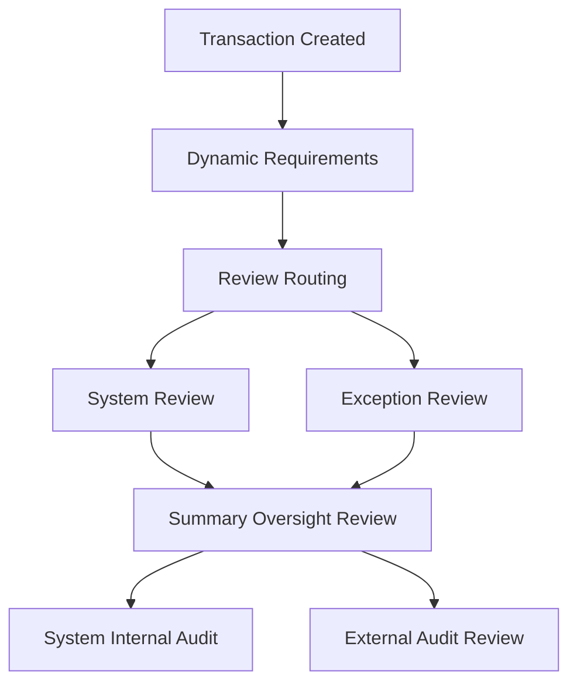

# Compliance Vision

Side's vision for providing compliance oversight at scale with high efficiency and low net cost-per-transaction. Replaces late-stage, manual compliance review with continuous, automated processing throughout the transaction lifecycle.

**Owner:** Cross-team ([[TXM Team]] primary, [[Payments Team]], [[Platform Team]] infrastructure)
**Status:** Mostly aspirational. TXM has begun building a rules model for upstream document validation. The [[Side Service Architecture|Brokerage Platform Architecture]] represents the engineering vision.

## Key Concepts

| Concept | Definition |
|---|---|
| **Inclusion Rule** | Determines whether a document is required for a transaction based on state, property type, year built, transaction type |
| **Validation Rule** | Evaluates data elements within/across documents |
| **Extraction Rule** | Defines key data points within a document for OCR/Document AI extraction |
| **Confidence Score** | Percentage from Data Extraction Engine indicating certainty; compared against thresholds for human review |
| **Risk Score** | Integer 1-100 per transaction/document. 100 = highest risk. Drives review routing |
| **Soft Gate** | Non-blocking UI warning via JSON Logic from compliance-service, executed in browser |
| **Hard Gate** | Blocking server-side validation. Transaction cannot progress until compliance-service returns PASS |
| **Definition vs. Instance** | compliance-service owns definitions (templates, rules). Lifecycle services create immutable instances per transaction |

## Three Engines

### Rules Engine
Codifies document and data requirements. Called at transaction creation, on data/document changes, and at final review. Lives in `compliance-service`.

### Data Extraction Engine
Extracts and validates data from uploaded documents using OCR and Google Document/Vision AI. Returns confidence scores; below-threshold results route to human review. Lives in `doc-processor-service`.

### Risk Engine
Assigns risk levels to transactions and documents, driving review intensity. Uses transaction-level factors (state, price, property type, agent history) and document-level factors (execution channel, historical accuracy, contents). Lives in `compliance-service`.

## Process Flow

1. **Dynamic Requirements** — Rules Engine determines required documents, re-evaluates on changes
2. **Review Routing** — Risk Engine + thresholds determine review mechanism per document
3. **Exception Review** — Simple (binary check) or Expert (full review by licensed specialist)
4. **Summary Oversight** — Managing Broker reviews all completed transactions, must explicitly Accept
5. **Audits** — Random blind internal audits to tune the system; external audit interface for regulators

## Service Architecture

| Vision Component | Service | Plane |
|---|---|---|
| Rules Engine | `compliance-service` | Brokerage |
| Risk Engine | `compliance-service` | Brokerage |
| Orchestrator | `compliance-service` | Brokerage |
| Data Extraction / OCR | `doc-processor-service` | Platform |
| Transaction lifecycle | `txm-service` | Domain |
| User/agent/TC data | `identity-service` | Domain |

## Data Signals

**Produces:** Risk scores, review outcomes, rejection rates, audit results, compliance state per transaction
**Consumes:** Transaction data (TXM), agent/TC profiles (Identity), document content (doc-processor), broker threshold settings
**Feeds into:** [[Partner Intelligence Vision|Partner Intelligence]], transaction state progression, Broker Ops dashboards, external audit interfaces

## Key References

- [Brokerage Platform Architecture (Confluence)](https://residenetwork.atlassian.net/wiki/spaces/PLAT/pages/4210524161)

## Related

- [[Side Service Architecture]]
- [[TXM Team]]
- [[Identity Project]]
- [[Partner Intelligence Vision]]
